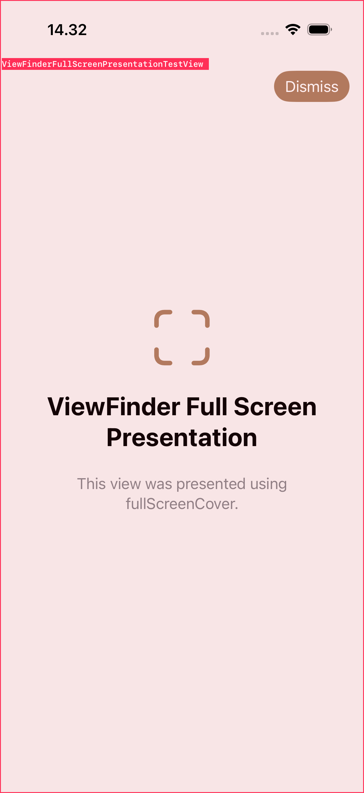

# SwiftUIViewFinder

SwiftUIViewFinder is a debug-only Swift package that identifies the active
SwiftUI view at runtime and draws a non-interactive overlay containing its
struct name.

Enable it once from `App.init()`. ViewFinder then follows tabs, navigation
pushes, hidden-tab destinations, and full-screen presentations without adding
modifiers throughout the application.

> [!WARNING]
> ViewFinder uses private SwiftUI runtime APIs. Keep it out of App Store
> release builds.

## Screenshots

| Selected tab | Navigation push with hidden tab bar | Full-screen presentation |
| --- | --- | --- |
|  |  |  |

The overlay window passes all touches through to the application. System sheets,
including `FamilyActivityPicker`, temporarily hide the overlay so they remain
fully interactive.

## Installation

Add the package with Swift Package Manager:

```swift
dependencies: [
    .package(
        url: "https://github.com/zmkhtr/SwiftUIViewFinder.git",
        from: "0.4.32"
    )
]
```

Then add the `ViewFinder` product to the application target.

## Quick Start

Enable ViewFinder before SwiftUI creates the root graph:

```swift
import SwiftUI
import ViewFinder

@main
struct MyApp: App {
    init() {
        ViewFinder.enable(mode: .overlayAndLogs)
    }

    var body: some Scene {
        WindowGroup {
            ContentView()
        }
    }
}
```

That one call is enough for navigation pushes and full-screen presentations.

For a `TabView`, register the root component for each tab once. ViewFinder reads
the selected UIKit tab automatically:

```swift
ViewFinder.enable(
    mode: .overlayAndLogs,
    tabComponents: [
        HomeScreen.self,
        SearchScreen.self,
        SettingsScreen.self,
    ]
)
```

No `.enableViewFinder(...)` or `.viewFinderComponent(...)` modifier is required
for the global workflow.

## Output Modes

```swift
ViewFinder.enable(mode: .overlay)
ViewFinder.enable(mode: .logs)
ViewFinder.enable(mode: .overlayAndLogs)
ViewFinder.disable()
```

Overlay styles:

```swift
ViewFinder.enable(
    mode: .overlayAndLogs,
    overlayStyle: .detailed
)
```

The overlay is intentionally non-interactive and uses a separate pass-through
window. It updates from lightweight UIKit navigation state and only performs
deeper SwiftUI inspection when the visible navigation structure changes.

## Optional Explicit Inspection

The original explicit APIs remain available for research and exact source
markers.

Mark a specific component:

```swift
HomeScreen()
    .viewFinderComponent()
```

Inspect a concrete root value:

```swift
ViewFinder.enable(mode: .logs)
let report = ViewFinder.inspect(RootView())
print(report.formatted())
```

Unsafe body evaluation is available only for controlled research views that do
not depend on SwiftUI-managed environment or dynamic properties:

```swift
let options = HierarchyOptions(bodyEvaluationPolicy: .unsafe)
ViewFinder.inspect(ResearchRootView(), options: options)
```

## Supported Behavior

- One-time global setup from `App.init()`
- Selected `TabView` root tracking with registered tab component types
- `NavigationView` and navigation-controller pushes
- Pushed destinations that hide the tab bar
- SwiftUI `fullScreenCover` presentations
- Pass-through overlays that do not block application interaction
- Automatic hiding for system and sheet presentations
- Change-based logging and cached overlay rendering

## Run The Tests

```bash
swift test

xcodebuild test \
  -scheme SwiftUIViewFinder-Package \
  -destination 'platform=iOS Simulator,name=iPhone 17 Pro'
```

## Limitations

- This is private-runtime, debug-only research software.
- Private SwiftUI APIs can change across iOS and Xcode releases.
- Registering tab root types is currently required for reliable `TabView`
  selection tracking.
- SwiftUI can erase component boundaries inside complex containers.
- Exact source file and line information requires `.viewFinderComponent()`.
- The overlay may contain noisy or overlapping labels for complex view graphs.

## Documentation

- [Research findings](Docs/Research.md)
- [Architecture](Docs/Architecture.md)
- [Troubleshooting](Docs/Troubleshooting.md)
- [Contributing](CONTRIBUTING.md)

## License

MIT
