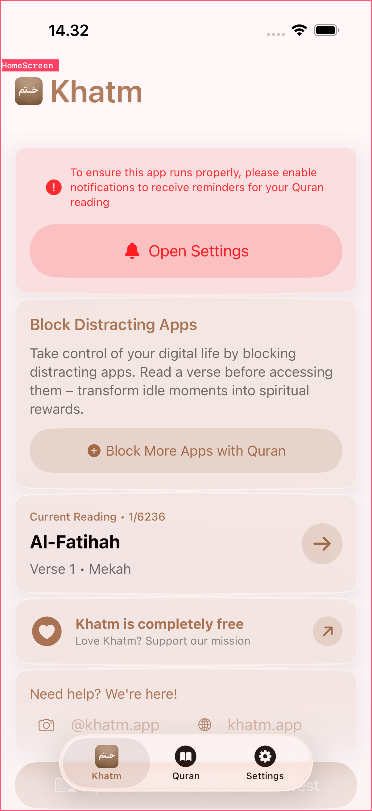
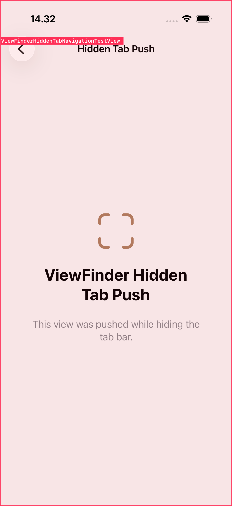

# SwiftUIInspector

SwiftUIInspector is a debug-only Swift package that identifies the active
SwiftUI view at runtime and draws a non-interactive overlay containing its
struct name.

[GitHub repository](https://github.com/zmkhtr/SwiftUIInspector)

Enable it once from `App.init()`. SwiftUIInspector then follows tabs, navigation
pushes, hidden-tab destinations, and full-screen presentations without adding
modifiers throughout the application.

> [!WARNING]
> SwiftUIInspector uses private SwiftUI runtime APIs. Keep it out of App Store
> release builds.

## Screenshots

| Selected tab | Navigation push with hidden tab bar | Full-screen presentation |
| --- | --- | --- |
|  |  |  |

The overlay window passes all touches through to the application. System sheets,
including `FamilyActivityPicker`, temporarily hide the overlay so they remain
fully interactive.

## Installation

Add the package with Swift Package Manager:

```swift
dependencies: [
    .package(
        url: "https://github.com/zmkhtr/SwiftUIInspector.git",
        from: "0.6.0"
    )
]
```

Then add the `SwiftUIInspector` product to the application target.

### Tuist

Add SwiftUIInspector to `Tuist/Package.swift`:

```swift
// swift-tools-version: 6.0
import PackageDescription

let package = Package(
    name: "AppDependencies",
    dependencies: [
        .package(
            url: "https://github.com/zmkhtr/SwiftUIInspector.git",
            from: "0.6.0"
        ),
    ]
)
```

Then add the external dependency to the relevant target in `Project.swift`:

```swift
dependencies: [
    .external(name: "SwiftUIInspector"),
]
```

Tuist external dependency names are case-sensitive. Use `SwiftUIInspector` for
the product name and `import SwiftUIInspector` in source files.

## Quick Start

Enable SwiftUIInspector before SwiftUI creates the root graph:

```swift
import SwiftUI
import SwiftUIInspector

@main
struct MyApp: App {
    init() {
        SwiftUIInspector.enable(mode: .overlayAndLogs)
    }

    var body: some Scene {
        WindowGroup {
            ContentView()
        }
    }
}
```

That one call is enough for navigation pushes and full-screen presentations.

For a `TabView`, register the root component for each tab once.
SwiftUIInspector reads the selected UIKit tab automatically:

```swift
SwiftUIInspector.enable(
    mode: .overlayAndLogs,
    tabComponents: [
        HomeScreen.self,
        SearchScreen.self,
        SettingsScreen.self,
    ]
)
```

No `.enableSwiftUIInspector(...)` or `.swiftUIInspectorComponent(...)` modifier
is required for the global workflow.

### UIKit Apps

Enable SwiftUIInspector once from `AppDelegate`:

```swift
import SwiftUIInspector
import UIKit

@main
final class AppDelegate: UIResponder, UIApplicationDelegate {
    func application(
        _ application: UIApplication,
        didFinishLaunchingWithOptions launchOptions: [UIApplication.LaunchOptionsKey: Any]?
    ) -> Bool {
        SwiftUIInspector.enable(mode: .overlayAndLogs)
        return true
    }
}
```

SwiftUIInspector follows SwiftUI views hosted directly inside
`UITabBarController` and views pushed with `UIHostingController`. See the
[UIKit demo](Example/UIKitDemo/README.md) for a runnable example and UI test.

## Output Modes

```swift
SwiftUIInspector.enable(mode: .overlay)
SwiftUIInspector.enable(mode: .logs)
SwiftUIInspector.enable(mode: .overlayAndLogs)
SwiftUIInspector.disable()
```

Overlay styles:

```swift
SwiftUIInspector.enable(
    mode: .overlayAndLogs,
    overlayStyle: .detailed
)
```

The overlay is intentionally non-interactive and uses a separate pass-through
window. It updates from lightweight UIKit navigation state and only performs
deeper SwiftUI inspection when the visible navigation structure changes.

## Optional Explicit Inspection

The original explicit APIs remain available for research and exact source
markers.

Mark a specific component:

```swift
HomeScreen()
    .swiftUIInspectorComponent()
```

Inspect a concrete root value:

```swift
SwiftUIInspector.enable(mode: .logs)
let report = SwiftUIInspector.inspect(RootView())
print(report.formatted())
```

Unsafe body evaluation is available only for controlled research views that do
not depend on SwiftUI-managed environment or dynamic properties:

```swift
let options = HierarchyOptions(bodyEvaluationPolicy: .unsafe)
SwiftUIInspector.inspect(ResearchRootView(), options: options)
```

## Supported Behavior

- One-time global setup from `App.init()`
- Selected `TabView` root tracking with registered tab component types
- UIKit `AppDelegate` and scene-based application windows
- SwiftUI views hosted in `UITabBarController`
- UIKit navigation pushes containing `UIHostingController`
- `NavigationView` and navigation-controller pushes
- Pushed destinations that hide the tab bar
- SwiftUI `fullScreenCover` presentations
- Pass-through overlays that do not block application interaction
- Automatic hiding for system and sheet presentations
- Change-based logging and cached overlay rendering

## Run The Tests

```bash
swift test

xcodebuild test \
  -scheme SwiftUIInspector-Package \
  -destination 'platform=iOS Simulator,name=iPhone 17 Pro'
```

## Limitations

- This is private-runtime, debug-only research software.
- Private SwiftUI APIs can change across iOS and Xcode releases.
- Registering tab root types is currently required for reliable `TabView`
  selection tracking.
- SwiftUI can erase component boundaries inside complex containers.
- Exact source file and line information requires `.swiftUIInspectorComponent()`.
- The overlay may contain noisy or overlapping labels for complex view graphs.

## Documentation

- [Research findings](Docs/Research.md)
- [Architecture](Docs/Architecture.md)
- [Troubleshooting](Docs/Troubleshooting.md)
- [Contributing](CONTRIBUTING.md)

## License

MIT
